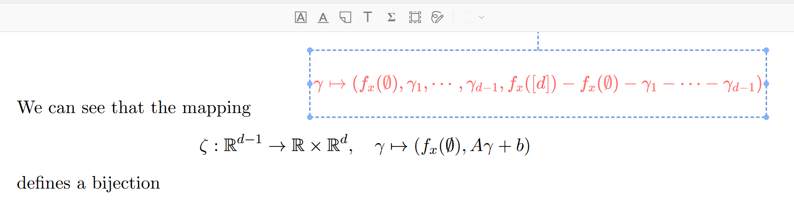

# Zotero LaTeX Math Tool

[](https://github.com/windingwind/zotero-plugin-template)

[中文说明](doc/README-zhCN.md)

A Zotero 9 plugin that adds a LaTeX math insertion tool to the PDF reader
toolbar. Equations are stored as Zotero free-text annotations with a small text
protocol and rendered back onto the PDF overlay with KaTeX.



## Usage

1. Open a PDF attachment in Zotero.
2. Click the `Σ` toolbar button.
3. Click a position on the PDF page.
4. Enter plain LaTeX without `$` or `$$`.
5. Keep `Display Mode` checked for larger block equations, or uncheck it for
   inline math.
6. Click `Insert` / `Save`.
7. Double-click a rendered formula to edit it later.

## Development

```bash
npm install
npm run build
```

The build command runs `zotero-plugin build` and `tsc --noEmit`. The packaged
`.xpi` is emitted by `zotero-plugin-scaffold` under `.scaffold/build`.

## Zotero Compatibility

The add-on manifest targets Zotero 9:

```json
"strict_min_version": "9.0",
"strict_max_version": "9.*"
```

## Acknowledgements

- [Zotero Community](https://www.zotero.org/)
- [Linux.do](https://linux.do/)
